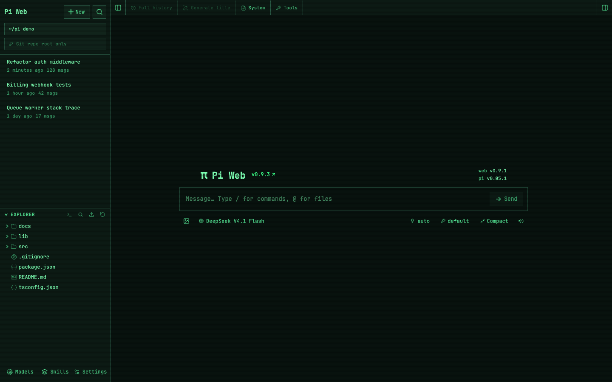
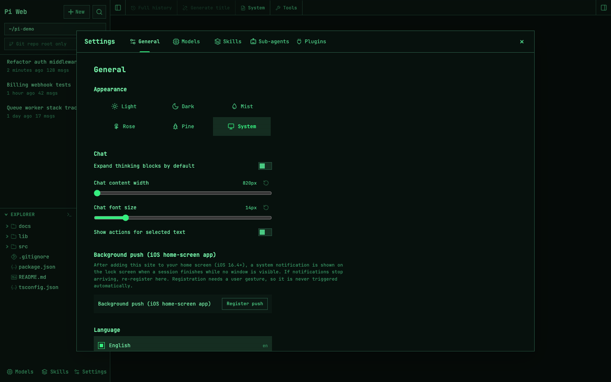

# pi-web custom theme — greenscreen

[中文说明](README.zh-CN.md) | English

A terminal / CRT skin for [pi-web](https://github.com/agegr/pi-web): monospace everything, sharp corners, scanlines, phosphor green. **One command to apply, one command to undo, and it survives `npm install -g` upgrades.**



## Highlights

- **Monospace everywhere** — JetBrainsMono Nerd Font with a sensible fallback chain, applied to the UI *and* the embedded terminal panel
- **Sharp corners**, CRT scanlines, phosphor-green palette
- The 5 built-in themes (Light / Dark / Mist / Rose / Pine) are re-mapped to 5 terminal palettes, so pi-web's own theme switcher keeps working — including "follow system"

| pi-web theme | becomes | background | foreground |
|---|---|---|---|
| Light | Phosphor Green | `#08120e` | `#7cffb2` |
| **Dark** | **Matrix** | `#020403` | `#00ff41` |
| Mist | Cyberdeck Cyan | `#001014` | `#7ef9ff` |
| Rose | Neon Magenta | `#120016` | `#ff9dff` |
| Pine | Amber CRT | `#140d00` | `#ffb000` |



## Why this is safe to try

| | |
|---|---|
| **Non-destructive** | It never rewrites pi-web's files. It appends one clearly marked block (`/* === pi-web-hacker-theme:BEGIN === */ … END */`) to the built CSS bundle. |
| **Byte-exact undo** | A backup of the original files is taken before the first change, with sha256 recorded. `use.sh off` restores them and verifies the hash. |
| **Never blocks you** | The optional startup wrapper re-applies the skin on every launch. If patching fails for any reason, pi-web still starts — you just lose the skin. |
| **Upgrade-proof** | After `npm install -g @agegr/pi-web@latest`, the wrapper notices the new bundle, archives the stale backup, rebuilds it, and re-applies the skin. Nothing to remember. |

## Requirements

- [pi-web](https://github.com/agegr/pi-web) installed (`npm install -g @agegr/pi-web@latest`)
- macOS or Linux, `bash`, `python3` (both ship with macOS)
- Optional: [JetBrainsMono Nerd Font](https://www.nerdfonts.com/) — without it the UI falls back to the bundled Noto Sans Mono

## Quick start

```bash
git clone https://github.com/adamcjm/pi-web-custom-theme.git ~/.pi/custom-theme
cd ~/.pi/custom-theme
./install.sh
```

`install.sh` will:

1. locate your pi-web installation (npm global root, `npx` cache, or the `pi-web` shim in `PATH`)
2. write the skin into it and remember the choice in `active`
3. add this repo's `bin/` to the front of `PATH` in your shell rc, so the skin is re-applied automatically after upgrades

Then hard-refresh the browser: **`Cmd+Shift+R`** (macOS) or **`Ctrl+Shift+R`**.

> Cloned somewhere else? That's fine — every script finds its own location, nothing is hard-coded to `~/.pi/custom-theme`.

## Usage

```bash
./use.sh                 # list skins and show syntax
./use.sh status          # switch state, patched files, backup record
./use.sh greenscreen     # apply (and remember) a skin
./use.sh off             # restore stock pi-web, verified by sha256
```

Applying or switching **does not require restarting pi-web** — Next.js reads that CSS from disk on every request.

Useful environment overrides:

| Variable | Purpose |
|---|---|
| `PI_WEB_PKG` | Point at the pi-web package if auto-detection fails |
| `PI_WEB_REAL` | Point the launcher wrapper at the real `bin/pi-web.js` |

## Updating pi-web

```bash
npm install -g @agegr/pi-web@latest
pi-web
```

That's it. With the launcher wrapper in `PATH`, the skin is re-applied automatically and the backup rebuilt for the new version. (If you installed with `--no-launcher`, just run `./use.sh greenscreen` after upgrading.)

## Uninstall

```bash
./use.sh off                  # back to stock, verified
# then: remove the PATH line this repo added to your shell rc,
#       and delete the clone
rm -rf ~/.pi/custom-theme
```

## Make your own skin

A skin is a single CSS file with a marked block:

```bash
cp -r greenscreen amber
$EDITOR amber/skin.css        # change --bg / --text / --accent
./use.sh amber
```

The palette lives in the `[data-theme="…"]` blocks at the bottom of the file — those map onto pi-web's own theme switcher.

## How it works

Three mechanisms, no pi-web source changes:

**1. CSS variable injection.** pi-web's entire look is driven by a compiled CSS bundle (Tailwind + a `[data-theme]` block of custom properties). The skin appends an override block inside markers:

```css
/* === pi-web-hacker-theme:BEGIN === */
… skin …
/* === pi-web-hacker-theme:END === */
```

`restore.sh` either strips that block or restores the recorded backup, then verifies sha256.

**2. Service-worker patch.** pi-web is a PWA whose service worker treats `/_next/static/` as **cache-first**, and the server serves those files as `immutable` (one year). Without help, a modified CSS file would never reach an already-visited browser. So `apply.sh` also patches `public/sw.js`:

| patch | effect |
|---|---|
| cache name gets a skin fingerprint (`-hc510d86a`) | activating the new SW drops the previous static cache |
| cache miss uses `fetch(request, { cache: "reload" })` | bypasses the `immutable` HTTP cache |

Change the skin → the fingerprint changes → every device (phone included) picks it up on refresh.

**3. Startup wrapper.** `bin/pi-web` sits in front of npm's shim. On each launch it re-applies the active skin (idempotently) and then hands over to the real launcher. Because it lives outside npm's directories, `npm install -g` can't overwrite it — that is what makes the skin survive upgrades.

## Layout

```
.
├── install.sh          one-shot setup
├── use.sh              switch / status / off
├── apply.sh            write the skin (+ self-healing backups)
├── restore.sh          byte-exact restore, sha256 verified
├── lib.sh              shared helpers (locates pi-web)
├── bin/pi-web          launcher wrapper (PATH)
├── active              current skin name (runtime state)
├── backup/             pristine pi-web files + manifest.json
├── greenscreen/        the skin
│   ├── skin.css
│   └── README.md
└── docs/               screenshots
```

## License

MIT — see [LICENSE](LICENSE).

This repository contains no pi-web code; it only patches the installed copy on your machine at runtime.
